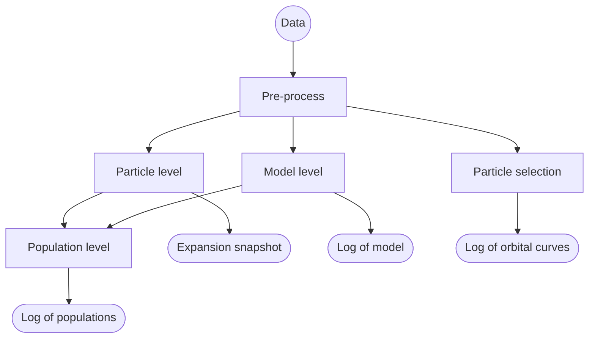

`galotfa`: **gal**actic **o**n-**t**he-**f**ly **a**nalysis, is a library for on-the-fly analysis of disk galaxy simulations.

______________________________________________________________________

## <a id="contents">Contents</a>

- <a href="#feature">Features of `galotfa`</a>
- <a href="#install">Installation</a>
- <a href="#scheme">Design scheme</a>
- <a href="#usage">Usage</a>

______________________________________________________________________

## Features of `galotfa` <a href="#contents">(contents)</a> 

1. Out-of-the-box: in general no need to modify the simulation code, just run some demos with simplest
   steps. If you feel hard to use some part of `galotfa`, please let us know.
1. User friendly program API and usage guidance: although we hope most functions of `galotfa` can be
   used out-of-the-box, we also provide detailed guidance for users to use `galotfa` in their own customized
   way.
1. Extensible: easy to add new analysis functions or apply to new simulation code which follows the general
   simulation convention. Besides, although this project is concentrated on disk galaxy simulations, it can
   also be easily extended to other types of simulations, such as cluster simulations, cosmology simulations,
   etc.
1. Notice us if you need more wonderful features: you-complete-me flavor, you can make this project better.
   We are also happy to merge your code into this project if you want.
1. Low dependency on other libraries: only standard libraries or included in the project.
1. Fast: use MPI and design to, a level of **~5%?** more CPU time during a run of simulation.
1. by the hand: `galotfa` repo also provides some extended version of widely used simulation codes,
   with `galotfa` built-in. You can also add `galotfa` in any simulation code by yourself or submit it.
1. Open: we welcome new participants who are interested in improve this project.

______________________________________________________________________

## Installation <a href="#contents">(contents)</a> 

### Dependencies

First, you need to check the following dependencies

- `make`: `galotfa` is organized by `make`, run `which make` to check the installation of `make` in your system.
  If you don't have `make`, please install it first.

- a `c++` compiler with `c++11` support, e.g. `g++`>4.8.5 or `clang++`>3.9.1 are recommended.

- dependent libraries:

  - any `MPI` library.
  - `gsl` library.

### Download and install step by step

1. clone the `galotfa` repo with `git`: run `git clone -b main https://github.com/blackbhc/galotfa --depth=1`

   If you don't have `git`, try `wget -O- https://github.com/blackbhc/galotfa/archive/main.zip | tar xz`.

1. run `cd galotfa`

1. run `make build mode=release type=header-only`.

   - the `mode` option can be `release` or `debug`, default is `release` which has `-O3` optimization mode.
     `debug` make the compiled library includes debug symbols for debugging which is only useful for developers.

   - the `type` option can be `header-only`, `static`, `shared`, `all`:

     - `header-only`: only copy the header files, no library files.
     - `static`: build the static library.
     - `shared`: build the shared library.
     - `all` = `static` + `shared`.

   Note:

   - (1) header-only is the default option, which is recommended for the first time installation.
     Such option will define a `header-only` macro in the `galotfa` header files, which will make the
     library can be used without linking to the library files.
   - (2) if you encounter any error during the installation, please check the error message and run
     `make clean` to clean the build files, then run `make build` again.
   - The header only mode is only available for `C++` compiler, and the `C` compiler will not be able to
     compile the `galotfa` header files. Therefore, to use `galotfa` in a simulation code written in `C`,
     the `type` option should be `static` or `shared`.

1. run `make -p <path/to/install>`:

   Create the directory for the installation of `galotfa`, if it already exists, skip this step.

1. run `make install prefix=</path/to/install>`:

   Install the `galotfa` to the directory specified by `prefix`, which should be the same as
   the one you specified in the last step.

1. After configure the `CPATH`, `LIBRARY_PATH` and `LD_LIBRARY_PATH` environment variables,
   you can use `galotfa` in your project.:

   - (temporary) run `export CPATH=$CPATH:<prefix>/include`, `export LIBRARY_PATH=$LIBRARY_PATH:<prefix>/lib`,
     `export LD_LIBRARY_PATH=$LD_LIBRARY_PATH:<prefix>/lib` before you compile your project every time.

   - (permanent) add the above three `export` commands into your shell configuration file:

     e.g. `~/.bashrc` for `bash` or
     `~/.zshrc` for `zsh`. You can run `echo $SHELL` to check your shell type, which will print something
     like `/bin/bash` to your terminal. Then run `source ~/.bashrc`/`source ~/.zshrc` to make the changes take effect.
     Then you can use `galotfa` without configure every time.

1. If you want to uninstall `galotfa`, run `make uninstall` in the `galotfa` repo directory.

   If the install path contain `galotfa`, then such directory will be removed completely. Otherwise, only
   the `galotfa` library files under such directory will be removed.

______________________________________________________________________

## Usage <a href="#contents">(contents)</a> 

### Get start with examples

### Complete illustrations

#### INI parameter file

Note: the section name is case sensitive, but the key/value name is case insensitive.

- available boolean: case insensitive `true` and `false`, `on` and `off`, `enable` and `disable`, `yes` and `no`.
- available value type: boolean, string(s), number(s). For numbers, there is no difference between integer and
  float, but the value(s) will be converted to required type of the target parameter.
- comment prefix: `#` and `;`.
- supported value separator: white space, `,`, `-`, `+`, `:` and `&`. Note: the name of key can not contain these characters.
- unexpected additional value for a key will be illegal, e.g. `<a key for boolean> = true yes` will make the parser to detect
  the value of the key as `true yes`, which is in string type and may cause error in the following parsing.

#### List of parameters for `galotfa`

All the parameters are listed below, and their function is indicated by the name, or you can click the link
to see their explanation.

| Section    | Key Name                                                     | Value Type | Default       | Available Values                                            |
| ---------- | ------------------------------------------------------------ | ---------- | ------------- | ----------------------------------------------------------- |
| `Global`   |                                                              |            |               |                                                             |
|            | <a href="#demo">`demo`</a>                                   |            |               |                                                             |
|            | <a href="#switch">`switch`</a>                               | Boolean    | `on`          |                                                             |
|            | <a href="#output_dir">`output_dir`</a>                       | String     | `./otfoutput` | Any valid path.                                             |
|            | <a href="#target_types">`target_types`</a>                   | Integer(s) |               | Based on your IC of simulation                              |
|            | <a href="#convergence_type">`convergence_type`</a>           | String     | `absolute`    | `absolute` or `relative`.                                   |
|            | <a href="#convergence_threshold">`convergence_threshold`</a> | Float      | 0.001         | $(0, 1)$ if `convergence_type` = `relative`, otherwise $>0$ |
|            | <a href="#max_iter">`max_iter`</a>                           | Integer    | 25            | $>0$                                                        |
|            | <a href="#equal_threshold">`equal_threshold`</a>             | Float      | 1e-5          | $>0$, but not too large.                                    |
|            | <a href="#sim_type">`sim_type`</a>                           | String     | `galaxy`      | Only support `galaxy` at present.                           |
| `Pre`      |                                                              |            |               |                                                             |
|            | <a href="#recenter">`recenter`</a>                           | Boolean    | `on`          |                                                             |
|            | <a href="#region_shape">`region_shape`</a>                   | String     | `sphere`      | `sphere`, `cylinder` or `box`.                              |
|            | <a href="#ratio">`ratio`</a>                                 | Float      | 1.0           | $>0$                                                        |
|            | <a href="#size">`region_size`</a>                            | Float      | 1.0           | $>0$                                                        |
|            | <a href="#recenter_method">`recenter_method`</a>             | String     | `com`         | `com`, `density` or `potential` (not yet supported)         |
|            | <a href="#align_bar">`align_bar`</a>                         | Boolean    | `off`         |                                                             |
| `Model`    |                                                              |            |               |                                                             |
| `Particle` |                                                              |            |               |                                                             |
| `Group`    |                                                              |            |               |                                                             |
| `Orbits`   |                                                              |            |               |                                                             |
| `Post`     |                                                              |            |               |                                                             |

#### Explanation of parameters

##### Global

This section specify some parameters that control the behaviour of `galotfa` on the machine.

- `switch`: whether to enable the demo mode or not. If `on`, `galotfa` will only run for a few steps
  and output some demo files to the `output_dir`. This option is only for test purpose or may be useful for some special cases.
- `output_dir`: the path to store the output files, create it if not exist.
- `target_types`: the type of target particle types to do the on-the-fly analysis, must be
  given at least one type, otherwise the program will raise an error.
- `convergence_type`: the type of convergence criterion for the on-the-fly analysis.
- `convergence_threshold`: the threshold for numerical convergence during the
  on-the-fly analysis.
  - `convergence_type` = `absolute`: the convergence criterion is $\\Delta$ $Q\<\\epsilon$ for some quantity $Q$,
    where $\\epsilon$ is the `convergence_threshold`.
  - `convergence_type` = `relative`: the convergence criterion is $\\Delta Q / Q \< \\epsilon$ for some quantity $Q$,
    where $\\epsilon$ is the `convergence_threshold`.
- `max_iter`: the maximum number of iterations during analysis.
- `equal_threshold`: the threshold for equality of two floating point numbers, e.g.
  if the threshold=0.001, then two float numbers $a$ and $b$ are considered equal.
- `sim_type`: the type of simulation, e.g. `galaxy`, `cluster`, `cosmology` and `cosmology_zoom_in`.
  At present, only `galaxy` is supported.

##### Pre

This section is about the pre-processing of the simulation data before some concrete analysis, such as calculate the
center of the target particle(s), calculate the bar major axis (if exist) and align the bar major axis to the $x$-axis.

- `recenter`: whether to recenter the target particle(s) to the center the target
  particle(s) or not, note the recenter is only for the on-the-fly analysis, and will not change the simulation data.

- `region_shape`: only meaningful when `recenter` = `on`, the shape of the region
  to calculate the center of the target particle(s), which will affect how the `region_size` is interpreted (see below).

  - `region_shape` = `sphere`: the region is a sphere or spheroid if `ratio` $\\neq$ 1, the axis of the spheroid is the
    parallel to the $z$-axis.
  - `region_shape` = `cylinder`: the region is a cylinder with symmetry axis parallel to the $z$-axis.
  - `region_shape` = `box`: the region is a box with sides parallel to the $x$, $y$ and $z$ axis.

- `ratio`: only meaningful when `recenter` = `on`, the ratio of the region's characteristic
  lengths, which will affect how the `region_size` is interpreted.

- `region_size`: only meaningful when `recenter` = `on`, the size of the region to calculate
  the center of the target particle(s), which will

  - `region_shape` = `sphere`: the region is a sphere with $R=$ `region_size` if `ratio` = 1. If `ratio` is not 1,
    the sphere will be stretched along the $z$-axis with $R_z=$ `ratio` $\\times$ `region_size`.
  - `region_shape` = `cylinder`: the region is a cylinder with $R=$ `region_size`, and half height $H=$
    `ratio` $\\times$ `region_size`.
  - `region_shape` = `box`: the region is a cube with side length $L=$ `region_size`, and stretched along the
    $z$-axis with $L_z=$ `ratio` $\\times$ `region_size`.

- `recenter_method`: the method to calculate the center of the target particle(s),
  with iteration if necessary (see `convergence_type` and `convergence_threshold`).

  - `recenter_method` = `com`: the center is defined as the center of mass of the target particle(s).
  - `recenter_method` = `density`: the center is defined as the pixel of the highest surface density of the target
    particle(s), the size of the pixel is determined by (???)
  - `recenter_method` = `potential`: not supported yet.

- `align_bar`: whether rotate the coordinates to align the $x$-axis to the bar major axis,
  this option is only available when the bar is detected. It's may be useful to align the bar major axis to the
  $x$-axis for some analysis or visualization.

##### Model

The model level on-the-fly analysis of the target particle(s). The most common case at present is a disk galaxy.

- `switch`: whether to enable the model level analysis or not.

- `region_shape`: similar to the `region_shape` in the `Pre` section, but this one is
  used to calculate the model quantifications of the target particle(s).

  - `region_shape` = `sphere`: the region is a sphere or spheroid if `ratio` $\\neq$ 1, the axis of the spheroid is the
    parallel to the $z$-axis.
  - `region_shape` = `cylinder`: the region is a cylinder with symmetry axis parallel to the $z$-axis.
  - `region_shape` = `box`: the region is a box with sides parallel to the $x$, $y$ and $z$ axis.

- `ratio`: similar to the `ratio` in the `Pre` section, but this one is used to calculate the
  model quantifications of the target particle(s).

- `region_size`: similar to the `region_size` in the `Pre` section, but this one is used to

  - `region_shape` = `sphere`: the region is a sphere with $R=$ `region_size` if `ratio` = 1. If `ratio` $\\neq$ 1, the sphere
    will be stretched along the $z$-axis with $R_z=$ `ratio` $\\times$ `region_size`.
  - `region_shape` = `cylinder`: the region is a cylinder with $R=$ `region_size`, and half height $H=$
    `ratio` $\\times$ `region_size`.
  - `region_shape` = `box`: the region is a cube with side length $L=$ `region_size`, and stretched along the $z$-axis with
    $L_z=$ `ratio` $\\times$ `region_size`.

- <a id="period_m"><a/>`period`: the period of model level analysis, in unit of synchronized time steps in
  simulation.

#### Output files

Due to there may be a case of a restart simulation, `galotfa` will not overwrite any existing file,
but create a new file with a `-n` suffix that start from 1, where `n` is the smallest integer that make the new file
name not exist. In this way, the suffix can be served as a restart index.

#### Use `galotfa` in general simulation codes

`galotfa` is based on `MPI`, and all `galotfa` APIs are designed to be used in `MPI` mode. So you need to
call `MPI_Init` before using any `galotfa` APIs.

**Note:** `galotfa` is designed to be used in `MPI` mode, so you need to call `MPI_Init`
before using any `galotfa` APIs.

______________________________________________________________________

## Design scheme <a href="#contents">(contents)</a> 

### Target physical quantities

The physical quantities of interested of `galotfa` are classified into two four types:

1. Model quantifications:
   - numerical precision: $\\Delta E$, $\\Delta L$
   - structure properties: center and axis of the disk, bar major axis, strength of the bar $S\_{bar}$, bar length $L\_{bar}$, peanutness $a_6$, axis ratio of the bar, symmetry parameters ($A_0$, $A_2$ ...).
   - dynamical properties: rotation curves, pattern speed, Toomre $Q$ parameter, velocity dispersion, anisotropies, buckling strength.
1. Particle quantifications:
   - orbital properties: angular momentum, energy, guiding radius, epicycle frequency, other orbital frequency, actions, circularity $\\epsilon$,
     3D circularity $\\epsilon \_{3D}$.
   - sub-grid physical properties: temperature, SFR, viscosity, acoustic velocity, density, metallicity.
1. Population level quantifications:
   Special case of model quantifications, but only for particular stellar population.
1. Selctital curves:
   Log exact positions of particular particles at one or several synchronized time bins to trace their exact curves during simulation.

### Basic workflow of `galotfa`

At particular synchronized time steps:

Every box is a functional module with independent implementation, which is class or a part of a class.
The details of them are illustrated in <a href="#code">Code structure</a>. The connection lines between
the boxes stands for the APIs between such modules. Expect the above modules, `galotfa` also uses a standalone
`INI` parameter file to control the behaviours of all modules and APIs in the preceding workflow.
